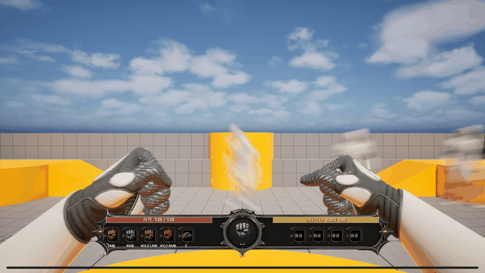

# 몸통 움직임과 카메라가 연결되는 1인칭 근접 공격

- 브랜치: Sprint#4-24-body-driven-first-person-melee
- 날짜: 2026-09-09
- 엔진: 설치 UE 5.8.2
- 상태: 구현·빌드·실게임·독립 소스 및 시각 검증 완료. 외부 영상 직접 재생은 미확인.

## 결과와 원인

기존 1인칭 표현은 전신 공격 몽타주를 평가하고도 손의 전진량만 사용했다. 몸통은 idle 상태로 유지하고 손은 두 고정점 사이를 왕복해, 팔과 시야가 몸의 힘을 전달하지 못했다.

현재 몽타주의 골반·척추·쇄골 변화와 손의 좌우·상하 궤적, 전진 전의 후퇴를 1인칭 표현에 반영했다. 바뀐 어깨 위치를 기준으로 팔 IK를 다시 계산하고 반대손의 가드 회수를 더했다. 닫힌 주먹과 엄지 방향은 유지한다. 별도의 무작위 흔들림 대신 같은 몽타주의 상체 변화가 카메라를 구동한다.

카메라는 최종 표시용 POV에서만 작은 위치·회전 변화를 적용한다. 기존 CameraComponent와 ControlRotation은 유지해 공격 판정의 원점·방향을 바꾸지 않는다. 무기 전환, 흔들림 강도 0, 사망 상태, 다른 시점으로 전환할 때 적용값을 초기화한다. 별도 Tick을 추가하지 않고 기존 카메라 평가 경로를 사용한다.

전신 전체를 1인칭 화면에 노출하는 작업은 아니다. 현재 어깨·팔 움직임과 카메라 동조로 몸의 체중 이동을 전달한다. 실제 캐릭터의 capsule 이동이나 공격 피해·사거리·타이밍, HUD 자산은 바꾸지 않았다.

## 실제 플레이 자료

실제 해금된 LMB 공격 3회를 촬영한 120프레임·5초 GIF다. Manny와 현재 테스트 맵의 실제 렌더링이며, 외부 레퍼런스 영상을 합성하거나 사용하지 않았다. 원본 PNG와 상하 시선·울트라와이드 캡처는 `images/body-melee-20260909/`에 보관한다.

## 설정과 기술 경계

- FistAnimInstance의 BodyMotionStrength 기본값 0.65. 0은 이전 몸통 고정 표현으로 돌아간다.
- 몸통 CS 이동 최대 4cm, 회전은 골반 6도/척추·쇄골 10도로 제한한 뒤 팔 IK를 다시 계산한다.
- 원본 손 잔차는 X 최대 8cm, Z 최대 6cm, 준비 후퇴 최대 7cm에 BodyMotionStrength를 적용한다. 반대손은 최대 3cm×강도로 회수한다.
- 카메라 원본 신호는 이동 길이 최대 2cm, pitch/yaw 각 1.5도, roll 0.8도. 컴포넌트의 CameraMotionScale로 0~1 조절한다.
- 카메라 필터는 초당 18의 지수 보간을 적용한다. 강도 0과 비활성 상태는 즉시 초기화한다.
- 몽타주에서 이미 가중된 포즈 차이를 사용하며 blend weight를 중복 적용하지 않는다.
- AnimProxy의 평가 결과를 NativePostEvaluateAnimation에서 게임 스레드 값으로 넘긴다. 평가 worker에서 카메라나 Controller를 변경하지 않는다.

## 검증

- 최초 통합 Editor 빌드 성공 25.95초. 독립 검토의 사망 가드 보완 후 최종 증분 빌드 성공 8.89초.
- 첫 실제 실행: 120프레임 실패 0, 시선 ±25도와 2560×1080 추가 3조건 통과.
- 측정: 척추의 가드 대비 최대 변화 11.396도, 손 수직 변화 3.900cm, 표시 카메라 회전 1.493도·이동 1.922cm. 척추 측정은 가드 시점 대비이며 idle 변화도 포함한다.
- CameraComponent와 ControlRotation 불변을 매 프레임 확인했다. 실제 PlayerCameraManager의 렌더 시야에서도 움직임을 확인했다.
- 120프레임 촬영 이후 추가 공격 2회에서 카메라가 실제로 움직이는 중 강도 0과 무기 전환 초기화를 검사한다. 최종 보강은 사망 상태 true 시 초기화, 상태 복원 후 다시 움직이는지까지 확인한다.
- 독립 소스 검증에서 사망 가드 누락을 발견해 수정했다. 단순히 정지 상태에서 강도 0을 검사하던 항목도 활성 공격 상태 검사로 보완했다.
- 독립 시각 검증은 공격 흐름 8장, 타격 연속 8프레임, 가드·복귀·상하·울트라와이드 5장으로 수행했다. 준비→신전→반대손 가드→복귀, 배경 동조와 HUD 고정, 손목·손가락·팔 연결과 중앙 시야가 통과했다.

최종 실행: RESULT=FIST_PRESENTATION_PASSED frames=120 failures=0. VIEW_AUDIT completed=3. CAMERA_CONTROLS_AUDIT의 active_scale_zero, active_weapon_switch, active_death_state 모두 통과했다. 독립 최종 소스 검토에서 잔여 중대·중간 회귀는 발견되지 않았다. 관련 로그: `evidence/body-melee-20260909/`.

## 레퍼런스 확인 범위

요청한 [YouTube Shorts](https://www.youtube.com/shorts/O2poybuky-M)는 웹 조회에 실패했고 직접 브라우저 시도도 Windows sandbox ACL 오류로 실행되지 않았다. [Mixamo box 검색](https://www.mixamo.com/#/?page=1&query=box&type=Motion%2CMotionPack)에서도 개별 모션을 재생하지 못했다. 따라서 외부 영상의 세부 프레임을 시청·계측하거나 Mixamo 파일을 적용했다고 주장하지 않는다.

이번 결과는 사용자가 설명한 전신의 체중 이동·휘두르기·카메라 동조 요구를 현재 프로젝트의 전신 몽타주에 반영한 것이다. 외부 영상과 프레임 단위의 일치 여부는 미확인이다. 접근 시도는 `evidence/body-melee-20260909/reference-access.md`에 기록했다.

## 변경 파일과 역할

- Character/Rogue10mFistAnimInstance.h/.cpp: 전신 포즈·손 궤적·카메라 신호.
- Components/Rogue10mFirstPersonPresentationComponent.h/.cpp: 카메라 동조 설정·필터·초기화.
- Core/Rogue10mCameraManager.h/.cpp: 최종 POV 연결.
- Tests/Rogue10mFirstPersonFistRuntimeTest.cpp: 몸통·손·실제 시야 및 활성 상태 복원 검증.
- paired 설계·결과 문서, 실제 캡처와 근거, DevLog 및 SprintChangeLog.

기획 1·개발 2를 먼저 배정하고, 검증 1은 설계 담당이 독립 소스 검토로 전환했다. 검증 2는 구현에 참여하지 않은 별도 에이전트가 실제 연속 프레임을 검토했다. 선행 미커밋 작업 보존, 신규 바이너리 자산 변경과 커밋·푸시 없음.
