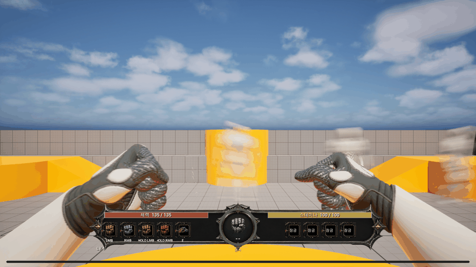

# 오버워치 근접 공격을 참고한 양손 방향 개선

- 작업: Sprint#4-23-quick-melee-hand-orientation
- 상태: 구현·UE 5.8.2 빌드·실게임·독립 소스 및 시각 검증 완료
- 요청: 왼손과 오른손이 돌아가 보이는 문제를 고치고 오버워치 근접 공격의 느낌을 참고한다.

## 결과

양팔에 고정 180도 회전을 넣던 보정을 제거했다. 각 손의 실제 골격에서 전방과 엄지 쪽 방향을 구하고, 주먹 전방은 전완에 맞추며 엄지는 위·안쪽을 향하도록 정렬한다. 가드는 15도, 타격은 35도 안쪽 기울기를 사용한다. 필요한 회전량은 전완에도 전달해 손목 경계의 비틀림을 줄인다.

원본 손가락의 빈 그립 형태도 보완했다. 네 손가락을 손바닥 방향으로 접고 엄지를 접힌 검지 바깥에 배치했다. 최종 굴곡 파라미터는 100/100/75도이며, 이는 이 골격 계산의 시각 조정값이지 사람 관절의 임상 각도값은 아니다. 기존 뼈 길이를 유지하고 포즈는 캐시한다. 원본 애니메이션, 굴곡 설정, 본 컨테이너가 바뀔 때만 캐시를 다시 계산한다.

기존 몽타주의 전진량과 재생 시점을 따라 짧은 전진·복귀를 표현한다. 공격 입력·피해·사거리·쿨다운·몽타주 속도, 카메라 위치·FOV, HUD와 원본 애니메이션 자산은 이번 작업에서 변경하지 않았다.

## 실제 플레이

- 960×540, 120프레임, 5초 GIF. 실제 게임에서 해금된 LMB 공격 3회와 복귀를 촬영했다.
- 원본 가드·타격·복귀와 상하 시선·울트라와이드 PNG 6장: `images/quick-melee-20260909/`.
- 현재 Manny와 테스트 맵의 결과다. 화면의 몬스터·XP 시험 상태는 임시 검증 fixture이며 자산에 저장하지 않았다.

## 검증

- `Scripts/BuildEditor.ps1 -NoHotReload`: 설치 UE 5.8.2 Editor 빌드 성공, 40.82초.
- `Rogue10m.TestFistPresentation views`: `RESULT=FIST_PRESENTATION_PASSED frames=120 failures=0`.
- 요청 공격 3회 모두 실제 몽타주 재생, 몽타주 54프레임, 최대 손 이동 18.4cm.
- 손 전방·전완 내적 1.000. 가드 엄지 쪽 축의 camera Z: 왼손 0.779, 오른손 0.876.
- 공격 확인 구간의 가드 대비 엄지축 변화 최대 30.3도. 반 바퀴 뒤집힘 없음.
- 네 손가락 중간 관절 굴곡 100도 유지, 뼈 길이 및 단계별 굴곡 유지 검사 통과.
- 가드 복귀와 Knuckle→Staff→Knuckle의 부모·소켓·변환·애니메이션·투영 복원 통과.
- 시선 pitch +25/−25도 및 2560×1080 추가 3조건 통과. 일반 촬영은 1280×720.
- 독립 소스 검증: 현재 Manny 구현에서 중대·중간 회귀 발견 없음.
- 독립 시각 검증: 최신 6장과 양손 확대 비교 통과. 이전 빈 그립보다 손바닥 공간이 줄고 닫힌 주먹으로 보이며, 손목 역전·명확한 엄지 관통·메시 단절이 관찰되지 않았다. 오른쪽 엄지가 약간 더 돌출돼 보이는 비대칭은 남아 있다.
- GIF 120프레임·5초·960×540 확인, 공백 및 Harness 경로 검사 통과.

로그와 원본 포즈 계측: `evidence/quick-melee-20260909/`의 build.log, runtime.txt, source-finger-angles.json.
기존 HUD 비율 코드와 자산을 수정하지 않아 지난 전체 HUD 7조건을 반복하지 않았고, 이번에는 손 방향과 관련된 화면 비율·시선 조건을 검증했다.

## 레퍼런스와 범위

[Blizzard Animation Station](https://news.blizzard.com/en-us/article/24239492/weekly-recall-animation-station)의 우양 quick melee 설명을 참고했다. 작은 움직임으로 힘을 표현하는 원인치 펀치와 선명한 자세를 표현 기준으로 삼았다. 특정 원작 프레임의 각도나 시간을 측정해 복제한 결과는 아니다.

공식 글의 [근접 공격 클립 링크](https://www.youtube.com/watch?v=oSC3CAONGFw)는 확인했지만 브라우저 도구의 Windows sandbox ACL 오류로 직접 재생하지 못했다. 공식 글의 설명과 실제 UE 렌더링을 근거로 작업했다.

## 변경 파일과 역할

- `Source/Rogue10m/Character/Rogue10mFistAnimInstance.cpp/.h`: 손·전완 방향, 닫힌 손가락 포즈 및 캐시.
- `Source/Rogue10m/Tests/Rogue10mFirstPersonFistRuntimeTest.cpp`: 방향·굴곡·복원 검사, 시선·울트라와이드 캡처와 튜닝 옵션.
- paired 설계 문서, 이 결과 문서와 증거, 한국어 DevLog 및 SprintChangeLog.
- 기획 1·개발 2·검증 2 역할을 동시 슬롯에 맞춰 단계별로 배정했다. 개발 파일 소유권을 분리하고 소스·시각 검토를 독립 수행했다.

선행 미커밋 변경은 보존했다. 새 바이너리 자산 변경, 커밋·푸시, 패키지 배포는 하지 않았다.
