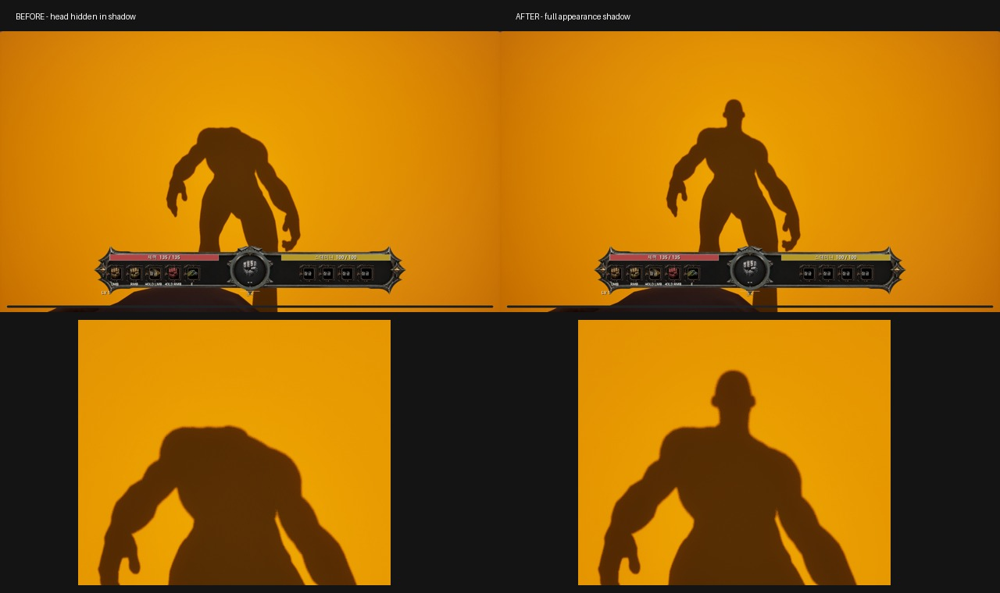

# 머리를 포함한 전신 그림자 복원

작성: 2026-09-28 / 작업 식별: Sprint#4-43-full-body-shadow

## 결과

실제 1인칭 게임 화면에서 머리 그림자를 복원했다. 화면용 Appearance Mesh는 기존처럼 head를 숨기고, 별도 그림자 전용 Poseable Mesh가 숨기기 전 raw local pose를 사용한다. 기존 Appearance 머리 카메라와 모션을 유지하며 First Person Mesh를 다시 켜지 않는다. V 3인칭에서는 원래 외형의 그림자로 복귀한다.

왼쪽은 기능 비활성, 오른쪽은 활성이다. 실제 게임 캡처의 frame20과 frame50이며 자세와 카메라를 고정했다. 비교 촬영에서는 바닥 그림자를 보기 위해 시선만 -50도로 설정했다. 게임의 기본 시선 설정을 변경하지 않았다.

## 변경 파일과 구조

- `Rogue10mAppearanceShadowComponent.h/.cpp`: 전신·LeaderPose 얼굴/머리카락 그림자 proxy, raw pose 복사, 본 매핑과 머티리얼 동기화, 원래 CastShadow 보존, 교체·종료 정리.
- `Rogue10mAppearanceCameraComponent.h/.cpp`: 기본 활성 `bEnableFullBodyShadow`, head-hidden 상태와 shadow 활성 연결, Restore 연결. 카메라 계산식은 유지.
- `Rogue10mAppearanceShadowRuntimeTest.cpp`: 동일 자세 전후 비교, 포즈·상태·네 공격과 실제 V 입력 검증 콘솔.

proxy는 hidden-shadow만 사용하며 MainPass/DepthPass/CustomDepth/충돌/중복 애니메이션 평가/독립 Tick을 사용하지 않는다. 원본 외형 그림자를 임시로 끄므로 같은 몸 그림자를 중복으로 만들지 않는다. 같은 본 수의 외형 교체도 RequiredBones를 새 애셋에 맞춰 재생성한다. 얼굴·머리카락은 현재 외형의 direct-child LeaderPose skeletal component 계약을 지원한다.

## 검증

| 항목 | 결과 |
|---|---|
| UE5.8 Editor 빌드 | 최종 성공, 7.28초 |
| 전신 그림자 런타임 | 390프레임, 실패0 |
| 실제 raw pose 일치 | 330샘플, 위치 오차0cm, 최대 회전 오차0.000002415도 |
| 공격 동기화 | 왼잽·오른잽·스트레이트·훅 모두 검사, 공격 중91샘플 |
| 전후 동일 조건 | head world pose와 camera cache 일치, 예상 머리 그림자 좌표599.8035,228.3282 동일 |
| 그림자 전환 | 실제 V 입력과 기능 비활성/재활성 시 원본 CastShadow 복원 및 proxy off 검사 |
| 기존 V 회귀 | 280프레임, 실패0 |
| 소스 QA | 기획1·개발2·검증2 역할 운영, 독립 소스 리뷰와 런타임 결과 검토 |
| 저장소 검사 | git diff --check 및 CheckGeneratedChanges 통과; 기존 바이너리 변경 경고는 이전 작업분 |

첫 빌드는 테스트의 Poseable API 이름 오류로 실패했고 GetSkinnedAsset으로 수정한 뒤 최종 빌드와 실행을 통과했다. 실패 로그도 증거 폴더에 보존했다. 이번 작업에서 바이너리 애셋은 편집하지 않았다.

## 범위와 한계

실제 확인한 외형은 Human Male, 현재 맵의 VSM 그림자다. ray-traced 그림자·반사에는 proxy를 등록하지 않으므로 해당 경로의 머리 복원은 보장하지 않는다. 얼굴/머리카락 교체와 EndPlay는 소스 검토 대상이며 별도 시나리오 캡처를 완료했다고 주장하지 않는다. 걷기/점프를 포함한 모든 외형·무기 조합, morph/cloth/groom, 비기본 lighting channels, 네트워크는 별도 검증하지 않았다. 추가 포즈 복사와 그림자 렌더 비용은 있으며 GPU 성능 수치를 측정하지 않았다.

## 작업 상태와 재현

Sprint#4-43 작업 브랜치에서 시작했다. 검증 도중 공유 체크아웃이 별도 작업의 Sprint#4-44-personal-studio로 바뀐 것을 확인하여 되돌리지 않고 기존 변경과 함께 보존했다. 커밋·푸시는 없다.

`Scripts/BuildEditor.ps1`로 빌드하고 게임 콘솔 `Rogue10m.TestAppearanceShadow`를 실행한다. `-RogueShadowNoCapture`로 캡처를 생략할 수 있다. `Rogue10m.TestThirdPersonInspection`으로 V 회귀를 검사한다. 그림자 기능은 Appearance Camera의 `bEnableFullBodyShadow`로 비활성화할 수 있다.

기획: `Feature/architect/2026-09-28_full-body-shadow.md`.
증거: `Feature/doc/evidence/full-body-shadow-20260928/`의 원본 전후 PNG, 비교 JPG, CSV, 실행/빌드 로그, 독립 리뷰, 소스 해시.
